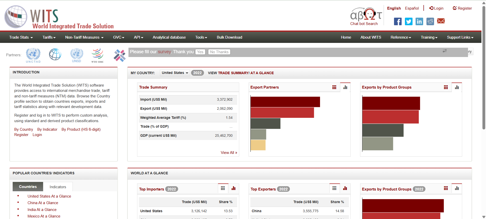
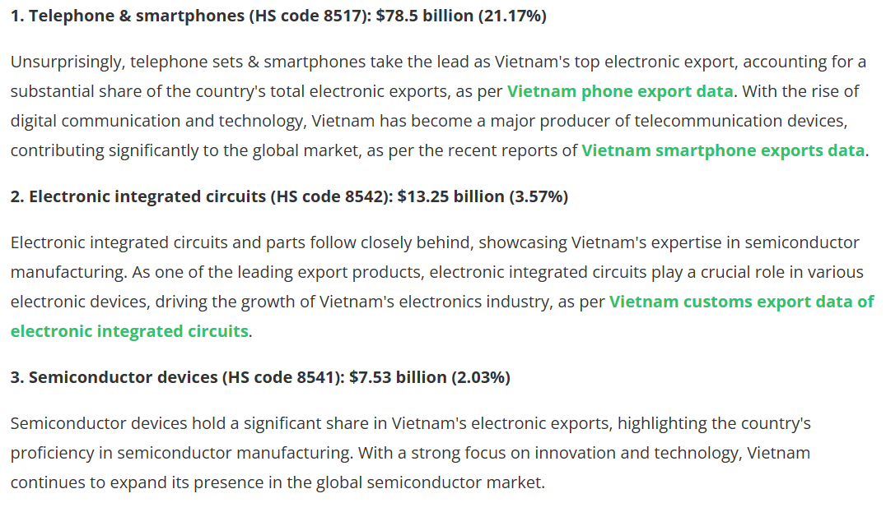
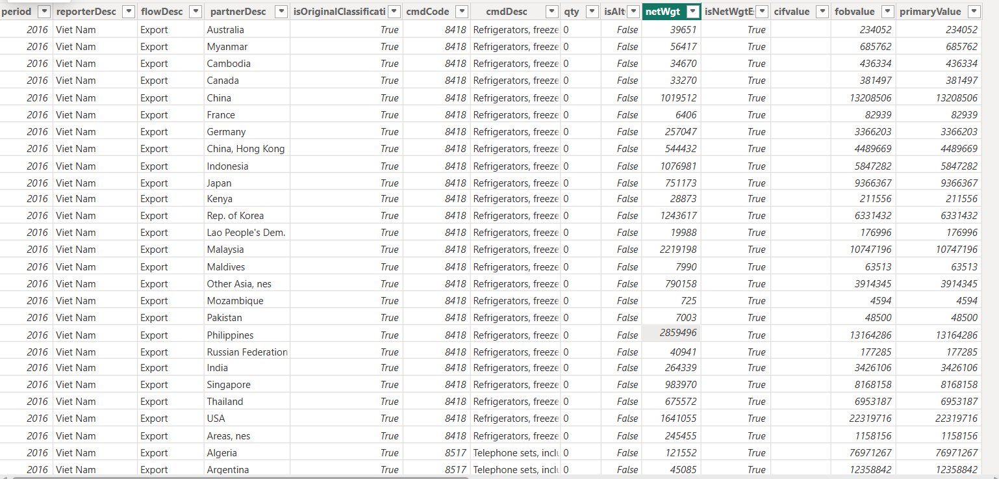
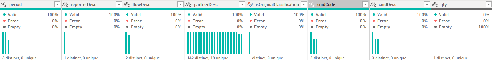
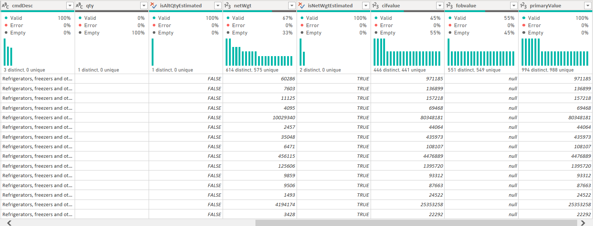
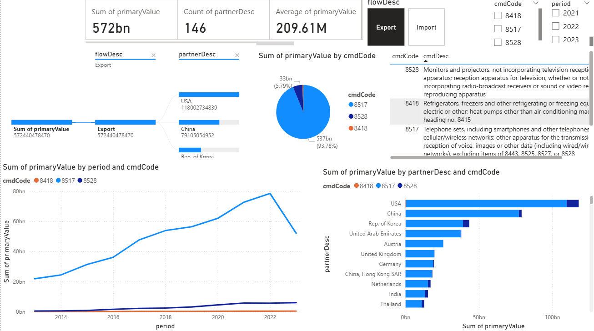
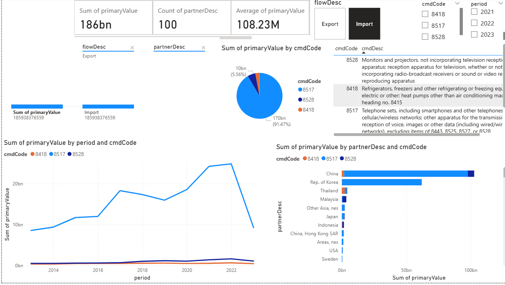

# E-Commerce Export and Import Dashboard (2013-2023)

This dashboard provides an in-depth view of global export and import data, broken down by product category (cmdCode) and partner country for the years 2013-2023. Using data visualization techniques, it presents the total value of exports and imports, the distribution of primary value by product code, and the performance across various countries.

The dashboard is ideal for finance, operations, and product teams to track performance, identify trends, and make data-driven decisions for optimizing trade relations and product offerings.

# Table of Contents
 
[Project Summary](#section_1) 
[Part 1: Data Source](#section_2) 
[Part 2: Key Metrics & Insights](#section_3) 
[Part 3: Dashboard Breakdown](#section_4) 
[Part 4: Recommendations & Next Steps](#section_5) 

# Project Summary

This project focuses on analyzing global export and import data for the years 2013-2023. The dashboard breaks down the primary value of goods by product category (cmdCode) and country (partnerDesc), enabling an in-depth understanding of trade flow dynamics.

## Key points include:

- **Total value of exports vs. imports**

- **Performance by product category (cmdCode)**

- **Top performing partner countries (e.g., China, USA, South Korea)**

- **Yearly trends and comparisons across 2013-2023**

The data will help stakeholders better understand shifts in product demand, identify high-value trade relationships, and explore opportunities for improvement in trade strategy.

# Data Source
## Information

The World Integrated Trade Solution (WITS) software provides access to international merchandise trade, tariff and non-tariff measures (NTM) data. Browse the Country profile section to obtain countries exports, imports and tariff statistics along with relevant development data.

## Methods to collect
- First, I framed [main exported electronic products](https://www.vietnamexportdata.com/blogs/vietnam-electronics-exports-2025-data-report) by HS Code (4 digit):

- Secondly, I called API [https://wits.worldbank.org/trade/comtrade/en/country/VNM/year/{YearPeriod}/tradeflow/{Exports_or_Imports}/partner/ALL/product/{HS_Code_4_digit}#] for each `Product`, `Trade flow`, `Year Period`.
- Finally, click download file `Excel` on the right top to download data.

## General View of Data

| Column Name                  | Description                                                                                                       |
| ---------------------------- | ----------------------------------------------------------------------------------------------------------------- |
| **period**                   | The year of the export data — in this dataset, all rows are from **2016**.                                        |
| **reporterDesc**             | The reporting country, which is **Vietnam** for all rows.                                                         |
| **flowDesc**                 | Indicates the trade flow direction — **Export** in all entries.                                                   |
| **partnerDesc**              | Destination (importing) country for the exported product.                                                         |
| **isOriginalClassification** | Indicates whether the product classification used is the original one (**True**).                                 |
| **cmdCode**                  | Commodity code based on the **Harmonized System (HS)** — e.g., 8418 (refrigerators, freezers), 8517 (telephones). |
| **cmdDesc**                  | Description of the product associated with the **cmdCode**.                                                       |
| **qty**                      | Quantity exported — always **0** in this dataset, possibly due to missing or unavailable data.                    |
| **isAlt**                    | Indicates if the record is from an alternative source — mostly **False**.                                         |
| **netWgt**                   | Net weight (in kilograms) of the exported goods.                                                                  |
| **isNetWgtEstimated**        | Indicates whether the net weight is estimated — mostly **True**, suggesting estimation methods were used.         |
| **cifvalue**                 | **Cost, Insurance, and Freight (CIF) value**, which includes shipping costs.                                      |
| **fobvalue**                 | **Free on Board (FOB) value**, which reflects the value of the goods excluding shipping.                          |
| **primaryValue**             | The main value used for analysis; often equals **FOB value**.                                              |

### Column Distribution and Quality

# Key Metrics & Insights

## Total Value:

- `Export`: $572.44bn

- `Import`: $185.93bn

- The total value of primary imports is approximately $185.93 billion, with exports significantly surpassing imports, **which indicates that in terms of electronic export, VietNam is an export surplus.**

## Top Products:

- The major product category is cmdCode 8517 (telecommunication sets, smartphones, and related products), accounting for 93.21% of the total value.

## Top Partners:

- China leads as the top partner country with a total value of $102.27bn.
- Other key partners include the USA, Rep. of Korea, and United Arab Emirates.

## Yearly Trends:
- There is a clear upward trend in cmdCode 8517 (Telephone sets) across 2013-2023, particularly driven by telecommunications equipment.
- Export performance consistently exceeds import performance in this period.

# Dashboard Breakdown
## Exports

### 1. Top Product Categories (cmdCode)
The export data is predominantly dominated by three cmdCodes, with a significant focus on `cmdCode 8517 (telecommunication equipment)`:
- `cmdCode 8517` (93.78%) represents $537 billion of the total export value. This category includes telephones and smartphones, which are part of the telecommunications network infrastructure. The dominance of this category is a clear indication of the global demand for mobile and telecommunications technology.
- `cmdCode 8528` (monitors and projectors) contributes only 5.79%, accounting for $33 billion. This is a much smaller proportion compared to cmdCode 8517, suggesting that although there is demand for visual display technology, it is not as high as for communication devices.
- `cmdCode 8418` (refrigerators and freezers) is not significant in this particular export data, contributing a very small fraction, as seen in the dashboard. This indicates lower export demand for refrigeration and cooling equipment during this period.

### 2. Top Export Partners (Partner Description)
The largest portion of exports flows to the USA and China, reflecting their importance as major trade partners:
    
- `USA:` The USA stands as the largest partner, receiving the highest export value, with a total of $118 billion. This is likely driven by demand for telecommunication equipment and consumer electronics, which aligns with the dominance of cmdCode 8517.
- `China:` China follows closely with $79 billion in exports. While China is a key importer of high-tech goods, it is also a hub for the manufacturing of components, contributing to its position as a major trade partner.
- `Rep. of Korea:` This country contributes $43 billion, ranking third, likely due to its import of high-value consumer electronics and smartphones from the export market.
- Other notable partners include the **United Arab Emirates, Austria, United Kingdom, Germany, and Netherlands,** each receiving significant export volumes. These countries may play key roles in the global supply chain for technology and communication devices.

### 3. Yearly Trends (2013-2023)
From the line chart of sum primary value by period, I observed the following trends:

- Steady growth in exports, particularly from cmdCode 8517, with a marked increase in exports post-2020, which could be attributed to the increasing demand for telecommunication products globally. This trend mirrors the growth of mobile technology and smartphones in the global market.
- The export volume for cmdCode 8418 remains low and flat over the years, with little to no growth in comparison to telecommunications products.

### 4. Conclusions
- `Telecommunication products (cmdCode 8517)` are the dominant category in export value, driven largely by smartphones and related tech. The USA and China are critical trade partners, with high demand for these products.
- `Monitors and projectors (cmdCode 8528)`, though growing, represent a smaller portion of exports, indicating that the demand for these products is secondary compared to telecommunications.
- `Refrigeration equipment (cmdCode 8418)` appears to be a minor export category with little growth in the recent years.
## Imports

### 1. Top Product Categories (cmdCode)
The import data shows a strong dominance of a few product categories:

- `cmdCode 8517 (telecommunication equipment):` This category represents **91.47%** of the total import value, with $170 billion attributed to products like smartphones and telecommunication sets. This highlights the continued high demand for communication devices and related infrastructure products globally.
- `cmdCode 8528 (monitors and projectors):` Contributes only **5.56%** with $10 billion in imports, which is much smaller compared to cmdCode 8517. Despite being a significant product category, its demand is much lower than telecommunication devices.
- `cmdCode 8418 (refrigerators and freezers):` Contributes a very small proportion of the total imports, indicating low demand for refrigeration and cooling products compared to telecommunication devices.

### 2. Top Import Partners (Partner Description)
- **China** stands as the largest import partner, with a total of $102.27 billion in imports, making up a significant share of the imports in this category. This is consistent with China’s position as a key supplier of electronics, including telecommunication devices.
- **Rep. of Korea** follows as the second-largest partner, with $61.97 billion in imports. This is likely driven by the demand for smartphones and other mobile technologies, with Korea being a major player in these industries.
- **Thailand** and other **Southeast Asian countries (Malaysia, Indonesia)** also appear as notable import partners, receiving a significant portion of the import value, primarily in the form of technology products.

### 3. **Yearly Trends (2013-2023)**
From the line chart of sum primary value by period, we observe the following:

- There is a clear upward trend in imports for `cmdCode 8517 (telecommunication products)` since 2017, especially post-2020, indicating a surge in demand for smartphones and telecommunications infrastructure products.
- `cmdCode 8418 (refrigerators)` has very little import growth, reflecting stable but low demand for cooling equipment in comparison to mobile devices.
- The increase in `cmdCode 8528 (monitors and projectors)` is more gradual, showing moderate demand for display technology products, likely due to increasing global demand for computing and gaming devices.

### 4. Other Insights
- The import market for telecommunication equipment continues to grow robustly, particularly in smartphones and other related networking devices.
- **China** continues to dominate as the top partner for imports, likely due to its large manufacturing capabilities in electronics.

### Conclusions

- `Telecommunication devices (cmdCode 8517)` continue to dominate imports, which reflects the global demand for smartphones, tablets, and other mobile devices.
- The growth in demand for monitors and projectors `(cmdCode 8528)` suggests rising interest in consumer electronics like gaming and display technologies.
- `Refrigeration equipment (cmdCode 8418)` remains a minor import category, with little demand growth over the period.

- The trade relationship with China remains vital, as it is the largest source for these imports, followed by South Korea.

# Recommendations & Next Steps
- **Monitor Export Performance:** The strong performance of cmdCode 8517 (telecommunication products) should be leveraged to explore new markets for similar products or related goods.
- **Strengthen Trade Relations with Top Partners:** Given the dominance of China, USA, and Rep. of Korea, focus on optimizing trade relations with these countries, enhancing product offerings based on demand.
- **Investigate Import Opportunities:** The import data suggests certain cmdCodes (e.g., 8418 related to refrigerating equipment) are underperforming. Investigating these areas for potential growth or cost-saving opportunities may be beneficial.
- **Explore New Markets:** Expanding partnerships with emerging markets, especially in regions like India and Southeast Asia, could further drive trade value and diversification.
